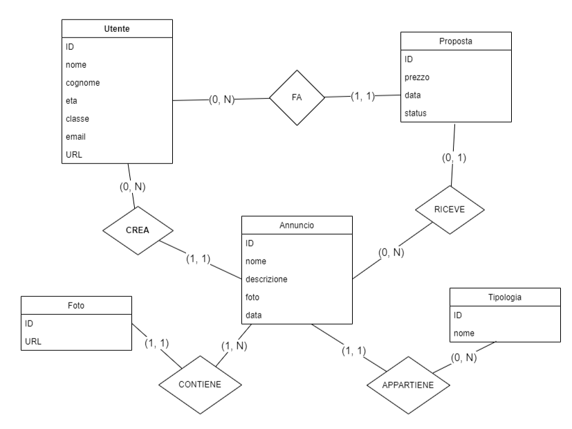

Progetto sito web completo per la vendita di beni da parte di utenti registrati in tutta italia.

**Tecnologie utilizzate:**
- Progettazione -> [Draw.io](https://draw.io)
- Front end -> html, css, js
- Back end -> php, mySql
---
### 1. Progettazione

In questa fase e' avvenuta la progettazione del diagramma ER:

Il gruppo ha ritenuto necessario specificare la `tipologia` dell'`annuncio` in una tabella separata per seguire le regole di normalizzazione. Stessa cosa per la questione delle `foto` che potranno essere piu' di una per ogni articolo.

Dopo una prima revisione e normalizzazione e' iniziato lo sviluppo del codice SQL per la creazione del DataBase `tardi`. Il codice e' stato testato sul servizio `PhpMyAdmin` e ne e' stato verificato il corretto funzionamento.

---

### 2. Sviluppo Web 
